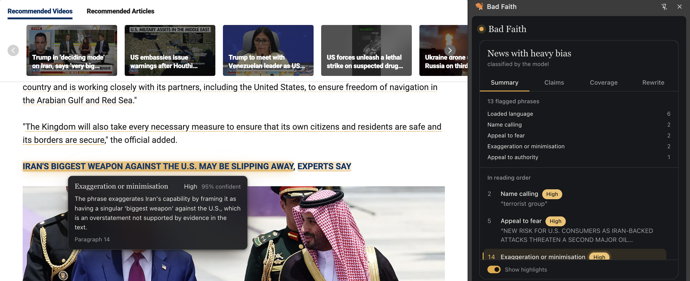
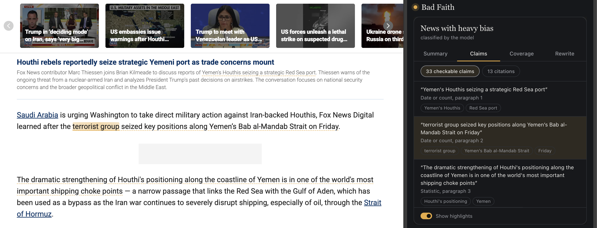
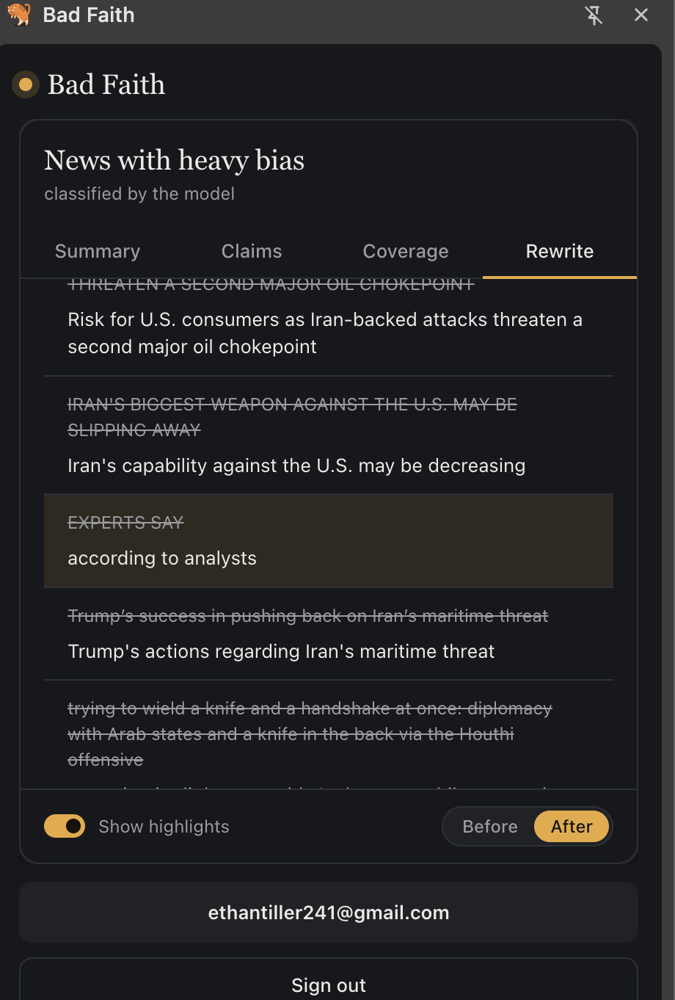
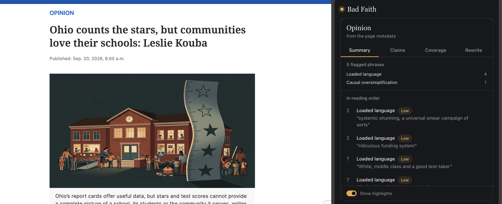

# Bad Faith 2026

## SteelHacks XIII Hackathon 2026

Project Members:
- Maxwell Blevins
- Jason Sun
- Ethan Tiller

## Inspiration

In today's attention economy, the news industry is increasingly driven by clicks rather
than context. Across the board, organizations are financially incentivized to use
provocative, sensationalized language to capture eyeballs instead of focusing on
objective, level-headed reporting. We built Bad Faith to help readers cut through the
noise, recognize manipulative rhetoric, and instantly verify claims so they can navigate
the modern web with confidence.

## What it does

Bad Faith is an automated news auditor wrapped in a Chrome extension. When you read an
article, the extension scans the text to highlight manipulative techniques like loaded
language, false dilemmas, or misleading statistics right on the page. Readers can then
choose to have those biased sections rewritten into neutral language for a more objective
perspective. It also extracts testable claims from the text, allowing users to instantly
verify them against a live consensus of other news outlets to see if a claim is
supported, contradicted, or missing crucial context. Finally, the tool verifies the
quotes used in the article and provides immediate background information on the speakers
and organizations, giving readers full context on exactly who is shaping the narrative.

| | | |
|---|---|---|
|  |  |  |
|  |  | |

## How we built it

We structured Bad Faith as a monorepo containing a TypeScript Chrome extension, a Python
3.12 FastAPI backend, and a standalone CLI evaluation harness. We utilized the Nemotron
LLM to classify rhetoric and extract entities. To power our real-time coverage
verification, we built a highly concurrent async pipeline using DuckDuckGo's news index,
pulling live reporting snippets to feed the LLM as evidence. We tied it all together with
Supabase for authentication and intelligent caching.

## Challenges we ran into

Building a fast, reliable coverage pipeline was our biggest hurdle. We initially tried
using the public GDELT API but were immediately bottlenecked by 429 rate limits. We also
realized that attempting to scrape full HTML from external news sites introduced massive
latency and bot-blocking issues. We successfully pivoted to a streamlined async search
pipeline that relies entirely on search engine snippets, cutting our verification latency
down to our strict ~3-second target.

## Accomplishments that we're proud of

We are proud of our robust evaluation and anti-hallucination safeguards. We rigorously
benchmarked the Nemotron model's performance using the SemEval dataset to ensure
high-quality, standardized rhetorical classification. To prevent the model from inventing
evidence, we built a strict grounding gate that verifies every single quote it references
exists verbatim in the original article. We also pushed beyond our initial scope by
engineering an entity-context feature that automatically surfaces background information
on the people and organizations quoted, giving readers immediate insight into exactly who
is speaking.

## What we learned

We learned that when building complex LLM tools, standardizing the data contract is
everything. We also learned the hard way that fetching live news data requires building
highly defensive, fail-open search clients. You don't always need to scrape the whole
web to fact-check; sometimes a clean, targeted search engine snippet provides the exact
context the model needs to make an accurate judgment.

## What's next for Bad Faith

We plan to expand our pipeline to support multi-language auditing, allowing users to
cross-reference claims against international reporting. Ultimately, we want to build a
public macro-dashboard that aggregates our data to track the long-term credibility and
rhetorical habits of major news outlets, holding the industry accountable at scale.

## Running it

1. `make install` — installs backend dependencies (`uv sync`).
2. `make dev` — starts the FastAPI backend with auto-reload.
3. `cd extension` then `make build` — builds the Chrome extension bundle, then load
   `extension/dist` as an unpacked extension in Chrome.
4. Set the required environment variables in a `.env` file at the repo root (see
   `backend/app/config.py` / run `make env-example` for a template): `DATABASE_URL`,
   `SUPABASE_URL`, `SUPABASE_ANON_KEY`, `NVIDIA_API_KEY`, `EXTENSION_ORIGIN`.

# Project structure and contracts

Bad Faith is a monorepo for a news article auditing product. The backend is a Python
3.12 FastAPI server, the frontend is a Chrome extension, and the eval harness is a
standalone Python CLI.

Use `badfaith` as the package/product slug unless a more specific deploy-time identifier
is intentionally chosen. The slug can affect the Python package name, extension ID, and
Firestore collection prefix, so keep it consistent across the stack.

```
badfaith/
├── extension/
├── backend/
├── eval/
├── docs/
├── .github/workflows/
└── README.md
```
